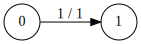
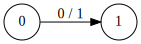
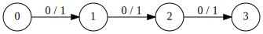
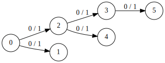
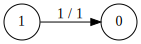
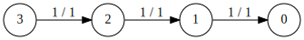
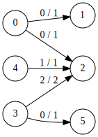
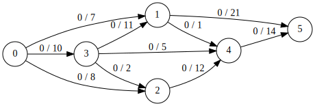

# OCaml - Max flow project

Base project for Ocaml project on Ford-Fulkerson. This project contains some simple configuration files to facilitate editing OCaml in VSCode.

To use, you should install the *OCaml* extension in VSCode. Other extensions might work as well but make sure there is only one installed.
Then open VSCode in the root directory of this repository (command line: `code path/to/ocaml-maxflow-project`).

## Based-project
### Running tests
Our `Graph.fulkerson` implementation has been tested with several tests you can run by yourself executing `make test`. This is the exhaustive tests list you can find in the `src/ftest.ml` file:

#### Test Tools.clone_nodes (graph1)
This tries to clone the `graph1` nodes into a `cloned_graph`. Then, It checks whether there is a node in the initial graph that is not present in the cloned graph (because the mapped graph is "cast" in the `map_test` function).

#### Test Tools.gmap (graph1)
This tries to convert the `int` graph to a `string` graph. If the compiler doesn't throw exception, the test passed.

#### Test Tools.add_arc (graph1)
This tries to add 5 to the arc's max flow between two nodes (that maybe didn't exist before the test). Then, we check whether the label was correctly updated.

#### Test Ford.dfs (graph3)
It tests the DFS algorithm on an **impossible** case : there are no arcs in the graph.

#### Test Ford.dfs (graph4)
It tests the DFS algorithm on an **impossible** case : the single graph's arc is full.

#### Test Ford.dfs (graph5)
It tests the DFS algorithm on a **possible** case : there is a valid path from 0 to 1 (0 -> 1).

#### Test Ford.dfs (graph6)
It tests the DFS algorithm on a **possible** case : there is a valid path from 0 to 3 (0 -> 1 -> 2 -> 3).

#### Test Ford.dfs (graph7)
It tests the DFS algorithm on a **possible** case : there is a valid path from 0 to 5 (0 -> 2 -> 3 -> 5).

#### Test Ford.dfs (graph8)
It tests the DFS algorithm on a **possible** case : there is a valid path from 0 to 1 (0 -> 1). It tests the availability of a reversed arc.

#### Test Ford.dfs (graph9)
It tests the DFS algorithm on a **possible** case : there is a valid path from 0 to 3 (0 -> 1 -> 2 -> 3) using only reversed arcs.

#### Test Ford.dfs (graph10)
It tests the DFS algorithm on a **possible** case : there is a valid path from 0 to 5 (0 -> 2 -> 3 -> 5) using reversed and normal arcs.

#### Test Ford.fulkerson (graph11)
It tests the Ford-Fulkerson algorithm. The graph's max flow is 25.

### Graph.inout_arcs
The `Graph` package now includes a `inout_arcs` function returning the list of all arcs into or out the given node id. This function is used by the `Graph.dfs` function to get all the arcs connecting the given node to the rest of the graph. This is important to get the arcs coming to the node for the `fulkerson` algorithm.

## Medium project
For upgrading the basic fulkerson algorithm's project, we implemented the [Host Matching Algorithm](https://www.anishathalye.com/2015/09/24/algorithms-in-the-real-world-host-matching/) using our `Graph.fulkerson` implementation.

### Match criteria
There is a famous conference gathering hackers and students from all the country. The students are hosting the hackers. The division among the students' house must match some criteria:
- A hacker should fill a form describing his software preferences: tabulations or spaces, brackets in the same line or in a new line, vim or emacs.
- The students could be opened to every preferences.
- Each individual is represented by a node in the graph. Each arc from a student to a hacker is a 1-flow arc representing an available match. If the arc is full (flow of 1 over 1), then the student is hosting the hacker.

### Execute
You can simply execute the algorithm on the `hostings/hosting1` example file using `make hosting`. This will directly print the algorithm's response in your terminal. If you want to save the response, you can add the `outfile` parameter like: `make hosting outfile=your_file`

## Makefile commands
A makefile provides some useful commands:
 - `make hosting` to compile and run the Medium-project part.
 - `make build` to compile. This creates an ftest.native executable
 - `make test` to run the `ftest` program with some arguments
 - `make format` to indent the entire project
 - `make edit` to open the project in VSCode
 - `make clean` to remove build artifacts
 - `make svg` to convert the generated `outfile` file into a SVG file.

In case of trouble with the VSCode extension (e.g. the project does not build, there are strange mistakes), a common workaround is to (1) close vscode, (2) `make clean`, (3) `make build` and (4) reopen vscode (`make edit`).

## Authors
This repository was made by Paul Thebault and Damien Molina based on the [Arthur Bit-Monnot's repository](https://github.com/arthur-bit-monnot/ocaml-maxflow-project).
